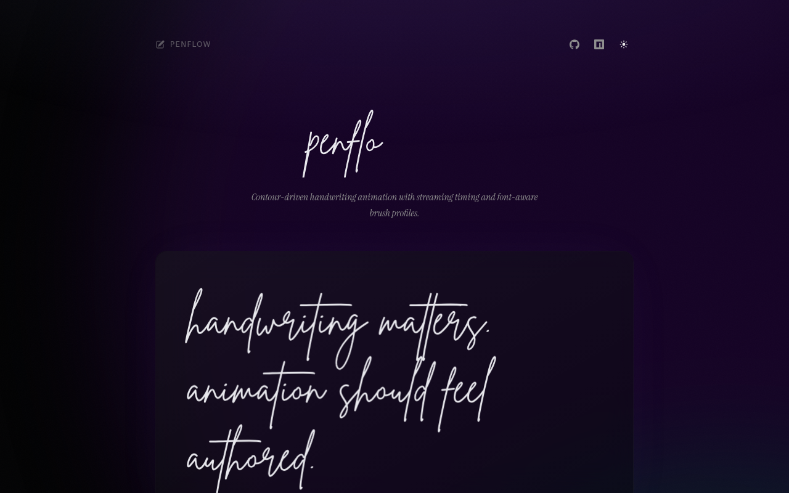

<p align="center">
  
</p>

<h1 align="center">
  penflo
</h1>

<p align="center">
  <em>Beautiful handwriting animation for the web.</em>
</p>

<p align="center">
  A premium interactive showcase for <a href="https://github.com/cristicretu/penflow"><strong>penflow</strong></a> — the contour-driven handwriting animation library.
  <br>
  Type anything. Watch it come alive as natural handwriting. Export as video or GIF.
</p>

<p align="center">
  <a href="https://www.npmjs.com/package/penflow"></a>
  <a href="https://github.com/cristicretu/penflow/blob/main/LICENSE"></a>
</p>

---

## What is penflo?

**penflo** is an interactive playground built around the [`penflow`](https://github.com/cristicretu/penflow) library. It takes any text you type and renders it as a real-time handwriting animation — not a prerecorded sequence, but a live contour-driven simulation that traces each glyph's outlines with font-aware brush profiles and natural timing.

The animation feels authored because it *is*: penflow parses the actual font contours using `typr.js`, builds stroke segments from glyph paths, and drives a canvas renderer with eased ink progression, per-character cadence jitter, and streaming-aware catch-up timing.

## Features

**Live handwriting animation** — type anything and watch it drawn in real-time with natural pen dynamics

**Interactive controls** — adjust quality (calm / balanced / snappy), choose fonts, and replay at will

**Export** — download your animation as WebM video or animated GIF, entirely client-side

**Dark & light themes** — premium glassmorphic UI with animated gradient background and smooth theme transitions

**Responsive** — works beautifully across desktop and mobile

## How the animation works

```
Font (.ttf) -> Glyph parsing (typr.js) -> Contour extraction -> Polyline segments
    -> Timing model (path length + complexity + cadence jitter)
        -> Canvas rendering (eased ink progression, clipped to fill path)
```

1. **Font parsing** — the font file is parsed at the glyph level, extracting bezier curves and contour data
2. **Contour extraction** — each character's outlines are decomposed into drawable polyline segments, sorted left-to-right
3. **Timing model** — per-character duration is computed from path length, character complexity, and seeded cadence jitter for natural variation
4. **Canvas rendering** — segments are drawn progressively with smoothstep easing, clipped to the glyph's fill path for crisp edges
5. **Streaming** — when text changes incrementally (e.g. during typing), the animation seamlessly continues from where it left off

## Built with

[Next.js](https://nextjs.org) · [penflow](https://github.com/cristicretu/penflow) · [shadcn/ui](https://ui.shadcn.com) · [Tailwind CSS v4](https://tailwindcss.com) · [Motion](https://motion.dev) · [Fancy Components](https://fancycomponents.dev) · [react-icons](https://react-icons.github.io/react-icons/) · [gif.js](https://jnordberg.github.io/gif.js/)

## Credits

Library by [Cristian Cretu](https://twitter.com/cristicrtu) · Inspiration from [Lochie Axon](https://lochie.me/)
