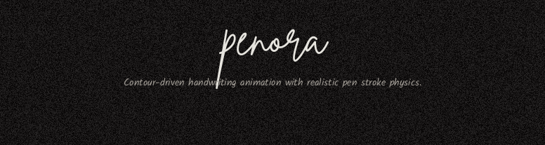

<p align="center">
  
</p>

<h1 align="center">
  penora
</h1>

<p align="center">
  <em>Beautiful handwriting animation for the web.</em>
</p>

<p align="center">
  Contour-driven handwriting animation with <strong>realistic pen stroke physics</strong> — pressure tapering, seeded jitter, and micro-wobble for organic line quality.
  <br>
  Type anything. Watch it come alive as natural handwriting. Export as video or GIF.
</p>

<p align="center">
  <a href="https://www.npmjs.com/package/penora"></a>
  <a href="https://github.com/satyajitghana/penora/blob/main/LICENSE"></a>
</p>

---

## Install

```bash
pnpm add penora
# or
npm i penora
# or
yarn add penora
# or
bun add penora
```

## shadcn registry

Install the `Penora` component directly into your shadcn project:

```bash
npx shadcn@latest add https://penora-ui.vercel.app/r/penora.json
```

This installs the `penora` npm package and adds `components/ui/penora.tsx` to your project.

## Usage

```tsx
import { Penora } from 'penora/react';

<Penora
  text="hello world"
  fontUrl="/fonts/BrittanySignature.ttf"
/>
```

Serve the font TTF from your `/public/fonts/` directory.

## Props

| Prop | Type | Default | Description |
|------|------|---------|-------------|
| `text` | `string` | required | Text to animate |
| `fontUrl` | `string` | required | URL to a `.ttf` font file |
| `color` | `string` | `'#0f1117'` | Ink color |
| `size` | `number` | `84` | Base font size in px |
| `speed` | `number` | `1` | Animation speed multiplier |
| `lineHeight` | `number` | `1.32` | Line height multiplier |
| `quality` | `'calm' \| 'balanced' \| 'snappy'` | `'balanced'` | Timing quality preset |
| `seed` | `string \| number` | `0` | Deterministic randomness seed |
| `brushScale` | `number` | auto | Brush width scale factor |
| `profile` | `PenoraProfile` | auto | Advanced brush/duration settings |
| `animate` | `boolean` | `true` | Whether to animate or render static |
| `incremental` | `boolean` | `true` | Append-aware streaming (typing) mode |
| `autoReplay` | `boolean` | `false` | Loop the animation |
| `playheadKey` | `number` | `0` | Increment to replay from the start |

## What makes penora different

**penora** enhances the base handwriting animation engine with realistic pen stroke physics:

- **Pressure tapering** — the stroke starts thin (nib touches paper), swells to full width, then tapers off (nib lifts). Replicates the feel of a real pen.
- **Seeded width jitter** — per-segment width variation (±18%) driven by a deterministic seed, so every character has a unique but reproducible pressure profile.
- **Micro-wobble** — a tiny seeded perpendicular displacement on each polyline point creates the organic imperfection of a human hand — no two strokes look mechanical.

## How it works

```
Font (.ttf) → Glyph parsing (typr.js) → Contour extraction → Polyline segments
    → Timing model (path length + complexity + cadence jitter)
        → Canvas rendering (pressure taper + width jitter + wobble + eased ink progression)
```

1. **Font parsing** — font files are parsed at the glyph level, extracting bezier curves and contour data via `typr.js`
2. **Contour extraction** — each character's outlines are decomposed into drawable polyline segments, sorted left-to-right
3. **Timing model** — per-character duration is computed from path length, complexity, and seeded cadence jitter
4. **Canvas rendering** — segments are drawn progressively with smoothstep easing, clipped to the glyph's fill path, with pressure taper and jitter applied per segment

## What is the penora playground?

The **penora** showcase website lets you:

- Type anything and watch it animate in real-time with 12 handwriting fonts
- Choose from 6 ink colours (Ink, Blue, Red, Green, Sepia, Pencil) — each with its own paper tone
- Adjust animation quality (calm / balanced / snappy)
- Export as WebM video or animated GIF (entirely client-side)
- Toggle dark / light mode

## Monorepo structure

```
penora/
├── packages/
│   └── penora/          # npm-publishable package
│       └── src/
│           ├── core/runtime.ts     # animation engine utilities
│           ├── react/Penora.tsx    # React component
│           ├── index.ts            # core exports
│           └── react.ts            # React exports
└── apps/
    └── web/             # Next.js showcase website
        └── public/r/    # shadcn registry (static JSON)
```

## Built with

[Next.js](https://nextjs.org) · [shadcn/ui](https://ui.shadcn.com) · [Tailwind CSS v4](https://tailwindcss.com) · [Motion](https://motion.dev) · [typr.js](https://github.com/photopea/Typr.js) · [gif.js](https://jnordberg.github.io/gif.js/) · [@fontsource](https://fontsource.org) · [Turborepo](https://turbo.build)

## Credits

Original animation concept by [Cristian Cretu](https://twitter.com/cristicretu) · Inspiration from [Lochie Axon](https://lochie.me/)
